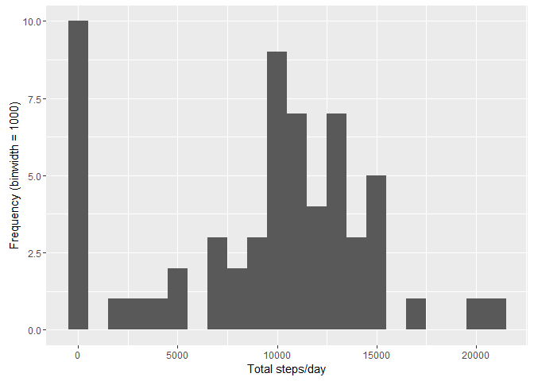
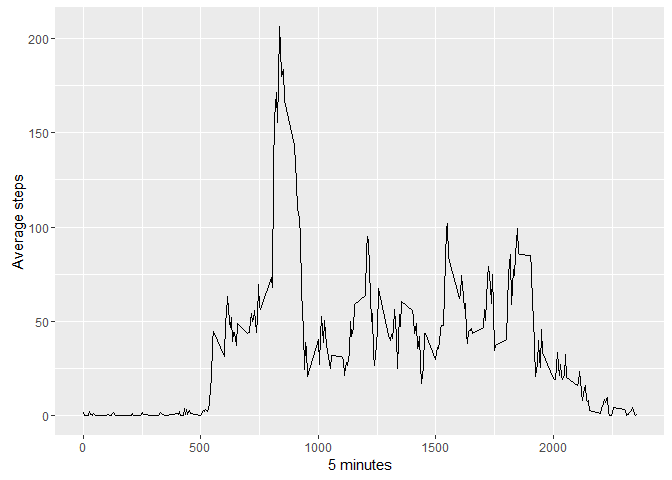
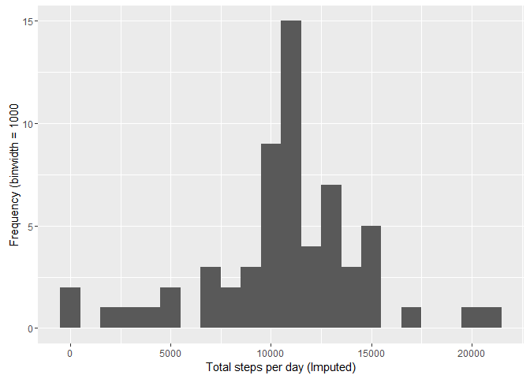

``` r
knitr::opts_chunk$set(echo = TRUE)
```

Reproducible Research
=====================

Project 01
----------

``` r
library(ggplot2)
library(Hmisc)
```

    ## Loading required package: lattice

    ## Loading required package: survival

    ## Loading required package: Formula

    ## 
    ## Attaching package: 'Hmisc'

    ## The following objects are masked from 'package:base':
    ## 
    ##     format.pval, round.POSIXt, trunc.POSIXt, units

### 1. Load the data from source file and pre-process

``` r
# Read activity file into activity
activity <- read.csv(file="C:/Users/Dave/Documents/DataScienceSpecialization/ReproducibleResearch/Project01/Working/Data/activity.csv")

# Pre-process data
activity$date <- as.Date(activity$date)
```

### 2. What is the mean total number of steps taken each day?

``` r
# Calculate steps per day and create histogram
stepsDay <- tapply(activity$steps,activity$date,sum,na.rm=TRUE)
qplot(stepsDay,xlab = "Total steps/day",ylab = "Frequency (binwidth = 1000)",binwidth=1000)
```



``` r
meanTotalSteps <- mean(stepsDay,na.rm = TRUE)
medianTotalSteps <- median(stepsDay,na.rm = TRUE)
```

The mean number of steps per day is 9354.2295082. The median number of steps per day is 10395.

### 3. What is the average daily activity pattern?

``` r
# Create time series plot
average <- aggregate(x=list(meanSteps=activity$steps), by=list(interval=activity$interval), FUN=mean, na.rm=TRUE)
```

``` r
ggplot(data = average,aes(x = interval,y = meanSteps))+geom_line()+xlab("5 minutes")+ylab("Average steps")
```



``` r
# Calculate which interval contains maximum number of steps
maxInterval <- average[which.max(average$meanSteps),]
```

The interval with the maximum number of steps is: 835, 206.1698113.

### 4. Input missing values in data and analyze differences in activity patterns between weekdays and weekends.

``` r
numMissingValues <- length(which(is.na(activity$steps)))
```

The number of missing values is: 2304.

``` r
# Impute missing values
activityImputed <- activity
activityImputed$steps <- impute(activity$steps, fun=mean)
stepsByDayImputed <- tapply(activityImputed$steps, activityImputed$date, sum)
meanISteps <- mean(stepsByDayImputed)
medianISteps <- median(stepsByDayImputed)
```

``` r
qplot(stepsByDayImputed, xlab='Total steps per day (Imputed)', ylab='Frequency (binwidth = 1000', binwidth=1000)
```



The mean steps/day is 1.076618910^{4} and the median is 1.076618910^{4}.

### 5. Difference in activity patterns between weekdays and weekends?

``` r
activityImputed$dateType <-  ifelse(as.POSIXlt(activityImputed$date)$wday %in% c(0,6), 'weekend', 'weekday')
# Make time series plots
averagedActivityImputed <- aggregate(steps ~ interval + dateType, data=activityImputed, mean)
```

``` r
ggplot(averagedActivityImputed, aes(interval, steps)) + 
    geom_line() + 
    facet_grid(dateType ~ .) +
    xlab("5-minute interval") + 
    ylab("avarage number of steps")
```


